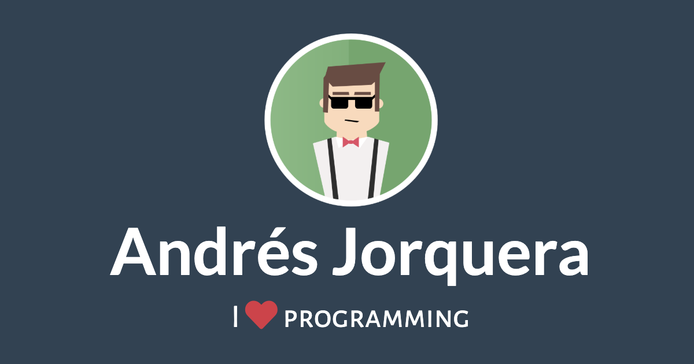

<h1 align="center"> <a href="https://andresjorquera.com">andresjorquera.com</a> </h1>

asdf

This is my personal website. It's just my way of quitting my job and make some kind of independence for myself. :shamrock:

Built using: 

